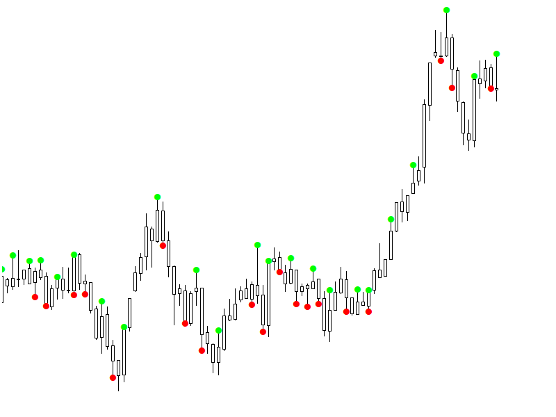

# Pullback Indicator (Based on Mr. Poursamadi's Method)

This indicator is designed to **detect pullbacks** based on the concepts taught in Mr. Poursamadi's trading course.  
It helps identify points where short-term trends experience a correction (pullback).

---

## Features

- **Low Pullback Detection**: When candle lows are moving higher and then a new low is formed below the previous one.  
- **High Pullback Detection**: When candle highs are moving lower and then a new high is formed above the previous one.  
- **On-chart signals** using customizable symbols (arrows, circles, squares, etc.).  
- **Fully customizable**:
  - Colors of the signals  
  - Symbol shapes (Wingdings character codes)  
  - Symbol width  

---

## How to Use
 
1. Copy .mt5 file into Indicators folder in metatrader data folder
2. Re-open  metatrader and search for pullback in custom indicators list

---

## Input Parameters

- **ColorLowChange** – Color for low pullback signals  
- **ColorHighChange** – Color for high pullback signals

---

## disclaimer

**Use the indicator output as visual guides; do not rely solely on them for trading decisions**
